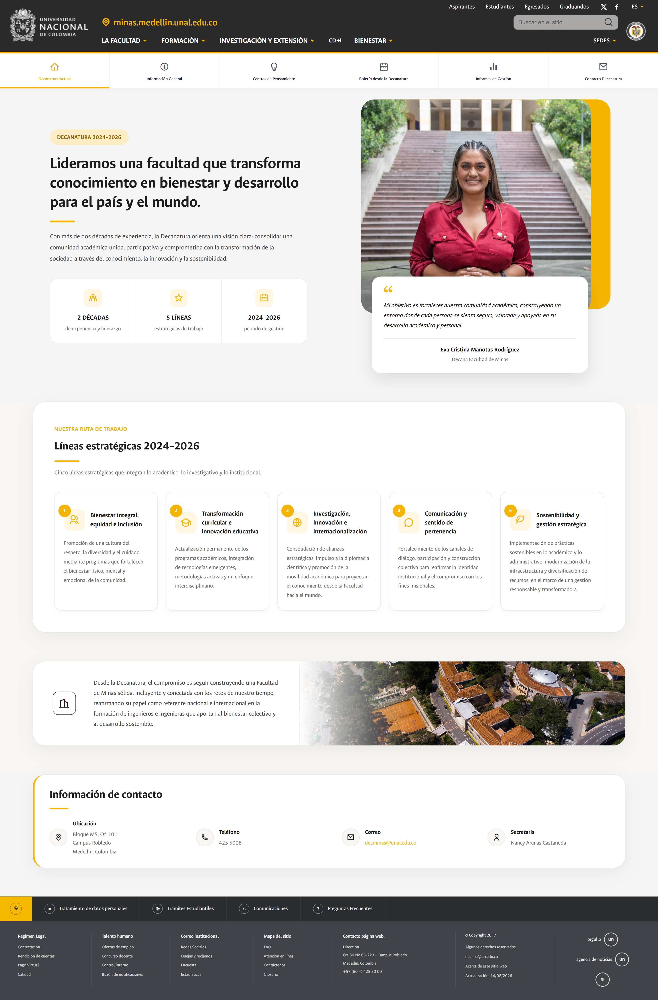
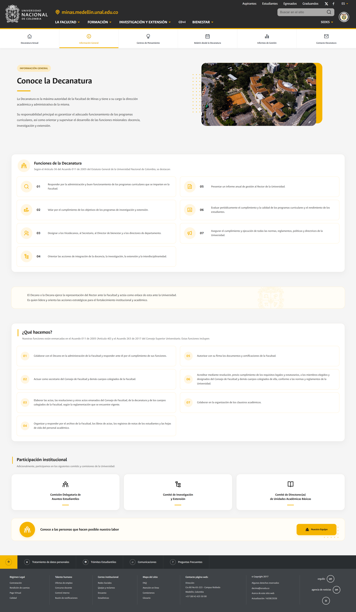
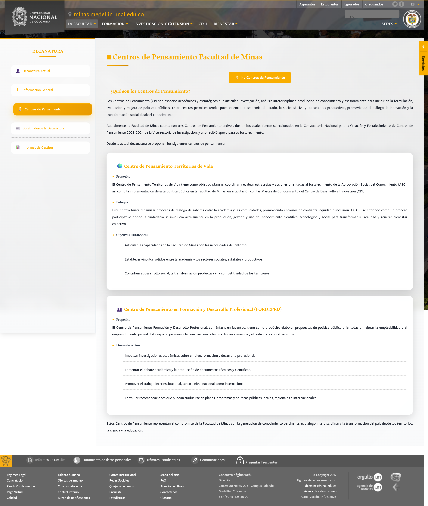
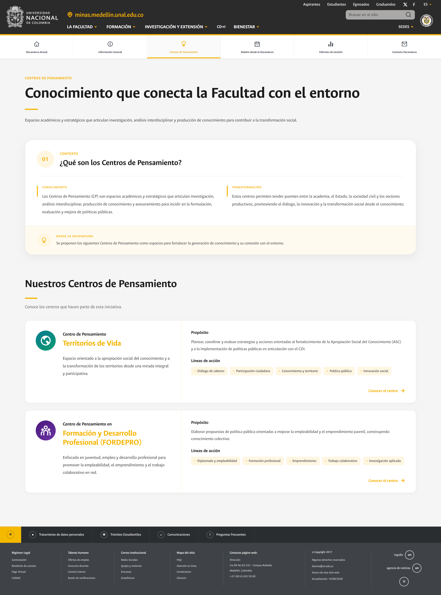
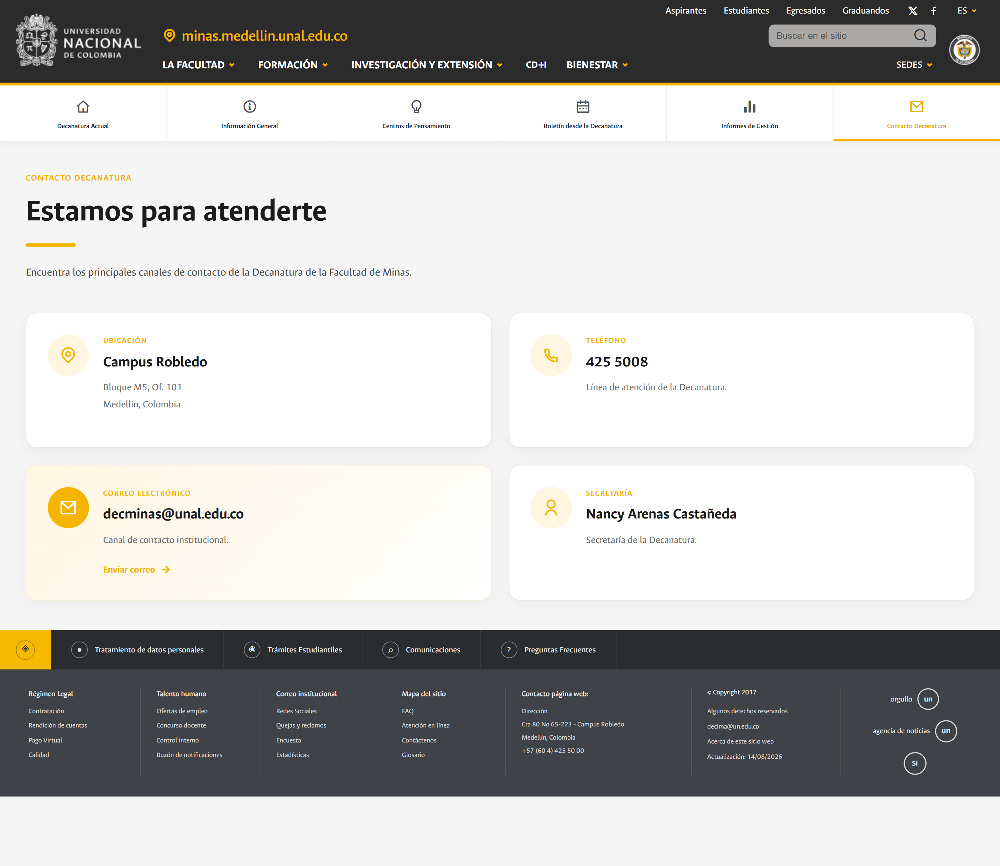

# Propuesta de rediseño – Home Decanatura Facultad de Minas UNAL

Este proyecto corresponde a una **propuesta de rediseño de la página principal (home)** de la Decanatura de la Facultad de Minas de la Universidad Nacional de Colombia – Sede Medellín.

El objetivo de la propuesta es **aprovechar el scroll como elemento narrativo**, reorganizar la información institucional y mejorar la experiencia de usuario sin perder la identidad visual de la Universidad.

🔗 **Sitio original:** https://minas.medellin.unal.edu.co/lafacultad/decanatura

🛠 **Tecnologías utilizadas:** HTML, CSS y JavaScript.

🌐 **Despliegue:** https://lualmara-5.github.io/decanatura-minas-home-redesign/

---

> [!NOTE]
> **Alcance de la propuesta**
>
> El rediseño se centra **exclusivamente en la página principal (home) de la Decanatura**.
>
> La **navbar (encabezado) y el footer (pie de página)** fueron incluidos únicamente como una **referencia visual** para mantener el contexto de navegación y presentar la propuesta como una página completa.
>
> Estos elementos **no forman parte del rediseño propuesto** y no buscan reemplazar la estructura institucional de la Universidad Nacional de Colombia, ya que corresponden a componentes globales compartidos por diferentes sedes, facultades y dependencias.
>
> Por esta razón, su implementación en esta propuesta es **representativa y simplificada**, mientras que el trabajo de diseño y reorganización se concentra en el contenido central del home.

---

## Diseño Responsive

Toda la propuesta de rediseño fue desarrollada teniendo en cuenta diferentes tamaños de pantalla y dispositivos.

La interfaz se adapta progresivamente a **escritorio, tablet y dispositivos móviles**, reorganizando los componentes y el contenido para mantener una experiencia de navegación consistente.

Entre las adaptaciones consideradas se encuentran:

* Reorganización de columnas y tarjetas.
* Ajuste de tamaños tipográficos.
* Adaptación de imágenes y elementos audiovisuales.
* Reestructuración de la navegación para pantallas pequeñas.
* Ajuste de espaciados y márgenes.
* Distribución vertical de contenidos cuando el espacio horizontal es limitado.

De esta manera, el rediseño no está pensado únicamente para una resolución específica, sino como una **interfaz responsive capaz de adaptarse al dispositivo desde el cual se consulta**.

---

## Estructura del home original

La página actual organiza la información en cinco accesos rápidos:

### DECANATURA

- 👤 **Decanatura Actual**
- ℹ️ **Información General**
- 💡 **Centros de Pensamiento**
- 📰 **Boletín desde la Decanatura**
- 📊 **Informes de Gestión**

En esta propuesta se rediseña **exclusivamente la sección “Decanatura Actual”**, integrando parte de la información más relevante en una experiencia continua de navegación vertical.

---

# 1. Decanatura Actual

## Diseño original

### Observaciones

Al analizar la versión actual se identifican varios puntos de mejora:

- La información principal se presenta en un **bloque de texto extenso**.
- El **sidebar izquierdo domina visualmente** la composición y reduce el espacio útil del contenido.
- Las líneas estratégicas aparecen como una **lista larga y repetitiva**.
- La fotografía de la decana tiene un papel secundario dentro de la jerarquía visual.
- El usuario debe recorrer una gran cantidad de texto antes de identificar los mensajes más importantes.

En conjunto, la página cumple su función informativa, pero la experiencia se percibe más cercana a un **documento institucional** que a una **home moderna orientada a la lectura rápida y al descubrimiento de información**.

---

## Propuesta de rediseño

---

## ¿Qué se mejoró?

### 1. Jerarquía visual clara

Se creó un **hero principal en dos columnas**:

- Izquierda: mensaje institucional y datos clave.
- Derecha: fotografía de la decana y cita destacada.

Esto permite que el usuario identifique rápidamente:

- quién lidera la facultad,
- cuál es el propósito del periodo 2024–2026,
- y cuáles son los ejes estratégicos.

---

### 2. Reducción de carga cognitiva

El texto introductorio fue resumido y complementado con **tarjetas de información rápida**:

- 🏆 **2 décadas** de experiencia y liderazgo.
- ⭐ **5 líneas estratégicas** de trabajo.
- 📅 **2024–2026** como periodo de gestión.

Estas tarjetas facilitan una lectura **más rápida y escaneable**.

---

### 3. Transformación de la lista en tarjetas

Las cinco líneas estratégicas dejaron de ser párrafos consecutivos y pasaron a un sistema de **cards independientes**.

**Beneficios:**

- mejor separación visual,
- lectura por bloques,
- mayor facilidad en dispositivos móviles,
- posibilidad de ampliar cada línea en el futuro.

---

### 4. Mejor aprovechamiento del scroll

La propuesta organiza el contenido en secciones consecutivas:

1. Hero institucional.
2. Líneas estratégicas.
3. Mensaje de compromiso institucional.
4. Información de contacto.

El scroll deja de ser únicamente desplazamiento y se convierte en una **narrativa visual progresiva**.

---

### 5. Mayor protagonismo institucional

La fotografía y la cita de la decana ahora funcionan como un elemento de confianza y cercanía, reforzando el carácter humano de la comunicación institucional.

---

## Resultado esperado

Con este rediseño se busca una interfaz:

- ✅ Más amigable.
- ✅ Más escaneable.
- ✅ Más moderna.
- ✅ Más accesible.
- ✅ Más cómoda para dispositivos móviles.

---

## Comparación visual

| Antes                                              | Después                                                |
| -------------------------------------------------- | ------------------------------------------------------ |
|  |  |

---

## Conclusión de esta sección

La propuesta **no modifica la identidad institucional de la Universidad Nacional de Colombia**; por el contrario, reorganiza el contenido existente mediante una jerarquía visual más clara, componentes reutilizables y una experiencia de navegación centrada en el usuario.

El resultado es una home que comunica la misma información estratégica de una manera **más eficiente, contemporánea y alineada con patrones actuales de diseño web institucional**.

---

# 2. Información General

## Diseño original

### Observaciones

La versión original presenta la información de la Decanatura principalmente mediante **bloques extensos de texto y listas consecutivas**.

Aunque la información es completa y cumple con su propósito institucional, se identifican algunas oportunidades de mejora desde el punto de vista de la experiencia de usuario:

* La página tiene una **alta densidad de texto**, lo que dificulta realizar una lectura rápida.
* Las funciones de la Decanatura se presentan como una **lista extensa y uniforme**, sin una jerarquía visual que permita distinguir fácilmente cada punto.
* Las diferentes secciones tienen una estructura visual muy similar, haciendo que el contenido se perciba como un único documento continuo.
* El menú lateral ocupa una parte considerable del espacio disponible y mantiene la atención del usuario sobre la navegación en lugar del contenido principal.
* La información introductoria no cuenta con un elemento visual que ayude a contextualizar la función de la Decanatura.
* Los contenidos de carácter institucional, aunque importantes, no están diferenciados visualmente según su propósito.

El principal reto no era reducir la información, sino **hacer que una cantidad considerable de contenido institucional fuera más fácil de recorrer y comprender**.

---

## Propuesta de rediseño

La propuesta conserva el contenido institucional de la página, pero modifica su presentación para convertirla en una experiencia más estructurada y visual.

### 1. Introducción con jerarquía visual

La información introductoria ahora se presenta como un **hero de contexto**, acompañado de una imagen representativa de la Facultad.

De esta manera, el usuario puede identificar desde el inicio:

* qué es la Decanatura,
* cuál es su función principal,
* y el contexto institucional al que pertenece.

La imagen permite además romper con la presentación exclusivamente textual de la versión original.

---

### 2. Funciones de la Decanatura como tarjetas

Las siete funciones principales dejan de mostrarse como una lista vertical de párrafos y pasan a organizarse mediante **tarjetas independientes distribuidas en dos columnas**.

Cada función cuenta con:

* numeración,
* iconografía,
* contenido independiente,
* y una separación visual clara respecto a las demás.

Esto permite que el usuario pueda **identificar rápidamente una función específica sin tener que recorrer toda la lista**.

La información no se elimina ni se simplifica de manera que pierda su significado institucional; simplemente se reorganiza para facilitar su lectura.

---

### 3. Separación de contenidos

La información ahora se divide en bloques claramente diferenciados:

* Introducción de la Decanatura
* Funciones de la Decanatura
* Información sobre el ejercicio de sus funciones
* Participación institucional
* Acceso al equipo de trabajo

Esta separación genera una **jerarquía de contenido más clara** y permite que cada sección tenga un propósito visual propio.

---

### 4. "¿Qué hacemos?" como contenido estructurado

La sección **¿Qué hacemos?** mantiene las funciones institucionales descritas en la página original, pero las presenta nuevamente mediante tarjetas numeradas.

Este cambio permite conservar información extensa sin que el usuario perciba la sección como un bloque continuo de texto.

La numeración funciona además como un elemento de orientación visual, facilitando la identificación de cada responsabilidad.

---

### 5. Participación institucional

La información relacionada con la participación de la Decanatura en diferentes comisiones y comités se transforma en **tres tarjetas independientes**.

Esto permite representar visualmente cada espacio de participación:

* Comisión Delegataria de Asuntos Estudiantiles
* Comité de Investigación y Extensión
* Comité de Directores(as) de Unidades Académicas Básicas

De esta manera, una información que anteriormente aparecía integrada dentro del contenido textual adquiere una **presencia visual propia**.

---

### 6. Acceso al equipo de trabajo

Al final de la página se mantiene el acceso a **"Nuestro Equipo"**, pero se convierte en un llamado a la acción más visible.

Esto establece una continuidad natural en la navegación:

**Conocer la Decanatura → conocer sus funciones → conocer su participación institucional → conocer a las personas que la conforman.**

---

## ¿Qué se mejoró?

| Antes                                 | Después                                     |
| ------------------------------------- | ------------------------------------------- |
| Gran cantidad de texto continuo       | Información dividida en bloques             |
| Listas extensas                       | Tarjetas independientes                     |
| Poca diferenciación entre contenidos  | Jerarquía visual por secciones              |
| Menor presencia de elementos gráficos | Iconografía e imágenes contextualizadas     |
| Lectura principalmente lineal         | Lectura más escaneable                      |
| Sidebar con gran protagonismo         | Mayor protagonismo del contenido            |
| Información presentada como documento | Información presentada como experiencia web |

---

## Comparación visual

| Antes                                              | Después                                                |
| -------------------------------------------------- | ------------------------------------------------------ |
|  |  |

---

## Resultado esperado

Con este rediseño se busca que una página con una cantidad considerable de información institucional pueda ser **consultada de manera más rápida y organizada**, sin sacrificar el contenido original.

El usuario puede recorrer la página de forma progresiva, identificar las secciones de interés y localizar una función específica con mayor facilidad.

La principal mejora no consiste en reducir el contenido, sino en **transformar la forma en que este contenido se presenta**.

> **De una página predominantemente textual a una experiencia institucional estructurada, visual y orientada al escaneo.**

---

## Consideración de diseño

En esta sección se mantuvo especial cuidado con el contenido institucional, ya que parte de la información corresponde a funciones y responsabilidades establecidas formalmente.

---

# 3. Centros de Pensamiento

## Diseño original

### Observaciones

La versión original presenta la información de los Centros de Pensamiento principalmente mediante **bloques extensos de texto**, acompañados por títulos y listas consecutivas.

Aunque permite consultar la información de cada centro, se identifican algunas oportunidades de mejora:

* La introducción y la información de los centros se encuentran dentro de un **flujo de lectura principalmente textual**.
* Los contenidos de cada Centro de Pensamiento tienen una estructura extensa y poco diferenciada visualmente.
* El usuario debe leer varios párrafos para identificar rápidamente el **propósito, enfoque u objetivos** de cada centro.
* La información de los diferentes centros no permite una **comparación visual inmediata**.
* El menú lateral ocupa una parte importante del espacio disponible para el contenido.
* El botón para acceder a los Centros de Pensamiento tiene un protagonismo que no aporta demasiado valor una vez el usuario ya se encuentra dentro de esta sección.

El reto en este caso fue presentar información académica y estratégica sin reducir su profundidad, pero haciendo que su consulta fuera **más clara, visual y escaneable**.

---

## Propuesta de rediseño

La propuesta reorganiza la sección en dos grandes momentos:

1. **Contextualización:** explicar qué son los Centros de Pensamiento y cuál es su importancia.
2. **Exploración:** presentar individualmente los centros que hacen parte de la iniciativa.

De esta manera, el usuario primero comprende el concepto y posteriormente puede conocer cada centro.

---

### 1. Encabezado orientado al propósito

La sección comienza con un encabezado de mayor presencia visual:

> **Conocimiento que conecta la Facultad con el entorno**

Este título busca comunicar en una sola frase el propósito general de los Centros de Pensamiento, acompañado de una breve descripción introductoria.

En lugar de comenzar directamente con contenido técnico, se establece primero un **contexto conceptual** para el usuario.

---

### 2. ¿Qué son los Centros de Pensamiento?

La información introductoria se reorganiza dentro de un bloque visual dividido en diferentes conceptos:

* **Contexto:** definición de los Centros de Pensamiento.
* **Transformación:** relación entre academia, Estado, sociedad y sectores productivos.
* **Desde la Decanatura:** propósito de esta iniciativa dentro de la Facultad.

Esta estructura permite separar conceptos que anteriormente se encontraban dentro de un flujo continuo de texto.

El objetivo es que el usuario pueda **comprender la iniciativa sin tener que leer toda la página**.

---

### 3. Presentación individual de cada Centro

Uno de los cambios principales consiste en transformar los centros en **componentes visuales independientes**.

Cada Centro de Pensamiento cuenta ahora con:

* Iconografía identificativa.
* Nombre del centro.
* Descripción general.
* Propósito.
* Líneas de acción.
* Acceso para conocer el centro.

Esto crea una estructura consistente que puede mantenerse incluso si en el futuro se incorporan nuevos Centros de Pensamiento.

---

### 4. Mayor diferenciación entre los centros

En la versión original, los diferentes centros aparecen como grandes bloques de información similares entre sí.

En el rediseño, cada centro se convierte en una **unidad visual claramente delimitada**, permitiendo identificar rápidamente dónde comienza y termina cada contenido.

Además, la distribución en columnas separa la información descriptiva de la información estratégica:

**Identidad y contexto**

Nombre, descripción y enfoque del centro.

**Propósito y líneas de acción**

Información específica sobre sus objetivos y áreas de trabajo.

Esta separación facilita la lectura y permite localizar rápidamente la información que interesa al usuario.

---

### 5. Información estratégica más escaneable

Las líneas de acción dejan de presentarse únicamente como párrafos o listas extensas y pasan a representarse mediante **etiquetas visuales**.

Por ejemplo:

`Diálogo de saberes` · `Participación ciudadana` · `Conocimiento y territorio` · `Política pública` · `Innovación social`

Este recurso permite identificar rápidamente las áreas de trabajo de cada centro sin necesidad de leer toda su descripción.

---

### 6. Acciones más claras

Cada Centro de Pensamiento incorpora un acceso de tipo **"Conocer el centro"**, estableciendo una acción clara para el usuario.

Esto permite que la página principal funcione como un **punto de exploración**, mientras que la información más detallada puede mantenerse en páginas específicas de cada centro.

De esta manera se evita sobrecargar la página principal con toda la información disponible.

---

## ¿Qué se mejoró?

| Antes                                            | Después                                            |
| ------------------------------------------------ | -------------------------------------------------- |
| Contenido predominantemente textual              | Contenido organizado visualmente                   |
| Grandes bloques de información                   | Componentes independientes                         |
| Difícil comparación entre centros                | Estructura consistente para cada centro            |
| Propósito y objetivos mezclados con el contenido | Información agrupada por categorías                |
| Listas y párrafos extensos                       | Etiquetas y bloques de información                 |
| Menor jerarquía visual                           | Jerarquía clara entre contexto, centros y acciones |
| Sidebar con gran protagonismo                    | Mayor aprovechamiento del área de contenido        |

---

## Comparación visual

| Antes                                              | Después                                                |
| -------------------------------------------------- | ------------------------------------------------------ |
|  |  |

---

## Resultado esperado

El rediseño busca convertir la sección de **Centros de Pensamiento** en un espacio de exploración y no únicamente de consulta documental.

La nueva estructura permite que el usuario pueda:

1. Comprender qué son los Centros de Pensamiento.
2. Conocer su relación con la Facultad y el entorno.
3. Identificar rápidamente los centros disponibles.
4. Entender el propósito de cada uno.
5. Reconocer sus principales líneas de acción.
6. Acceder a información más detallada cuando sea necesario.

De esta forma, se conserva la profundidad del contenido institucional mientras se mejora su **jerarquía, legibilidad y capacidad de exploración**.

> **De una página centrada en presentar información a una experiencia que permite descubrir y explorar los Centros de Pensamiento.**

---

## Criterio de escalabilidad

La nueva estructura también permite que la sección pueda crecer de manera ordenada.

Al utilizar una estructura visual consistente para cada Centro de Pensamiento, la incorporación de nuevos centros no requeriría modificar completamente el diseño de la página, sino **añadir nuevos componentes siguiendo el mismo patrón visual y de información**.

Esto permite mantener una interfaz coherente a medida que la iniciativa evoluciona.

---

Por esta razón, la propuesta se enfoca principalmente en **la presentación, organización y jerarquía visual del contenido**, evitando modificar su sentido institucional.

Esto permite modernizar la experiencia de usuario sin alterar la información que debe permanecer disponible para consulta.

---

# 4. Boletín desde la Decanatura

## Diseño original

La versión original ya presenta los boletines mediante una estructura de tarjetas, por lo que en esta sección el objetivo no fue realizar una transformación completa de la arquitectura del contenido.

El principal punto de mejora identificado fue la **presentación de los contenidos audiovisuales**.

Los videos ocupan una parte importante de esta sección, pero su visualización dentro de las tarjetas podía tener una mayor presencia y una relación más clara con la acción de reproducirlos.

---

## Propuesta de rediseño

La propuesta mantiene la estructura de tarjetas, pero convierte el contenido audiovisual en el **elemento protagonista de cada boletín**.

### ¿Qué se mejoró?

* Se utilizan previews de mayor presencia visual.
* Cada video cuenta con una representación clara de su acción de reproducción.
* Se mantiene una estructura consistente entre todos los boletines.
* La información complementaria se conserva debajo del contenido audiovisual.
* Se mejora la separación entre la imagen, el título, la descripción y la acción.
* Se facilita la identificación de los contenidos que pueden ser reproducidos.

De esta manera, la sección conserva la simplicidad de la versión original, pero genera una experiencia más cercana a una **biblioteca audiovisual de contenidos institucionales**.

> **El contenido audiovisual pasa de ser un elemento complementario a convertirse en el principal punto de entrada de cada boletín.**

---

## Comparación visual

| Antes                                              | Después                                                |
| -------------------------------------------------- | ------------------------------------------------------ |
|  |  |

---

# 5. Informes de Gestión

La opción **Informes de Gestión** corresponde a una redirección hacia una página independiente del sitio institucional.

Por este motivo, **no se realizó un rediseño de su contenido dentro de esta propuesta**.

El acceso se mantiene dentro de la navegación principal para conservar la estructura y facilitar el acceso a esta información.

---

# 6. Contacto Decanatura

## Nueva sección propuesta

A diferencia de las secciones anteriores, **Contacto Decanatura no corresponde a una sección existente en la página original**.

La información de contacto actualmente se encuentra dentro de **Decanatura Actual**, ubicada al final de dicha página.

Aunque esta ubicación permite consultar la información, puede generar una dificultad para un usuario que ingresa al sitio con una intención específica, por ejemplo:

> *"Necesito encontrar el correo o teléfono de la Decanatura."*

En ese escenario, el usuario tendría que navegar hasta **Decanatura Actual** y recorrer su contenido hasta encontrar la información de contacto.

### Propuesta

Se incorpora un acceso directo denominado **Contacto Decanatura** dentro de la navegación secundaria.

El objetivo no es duplicar innecesariamente la información, sino ofrecer un **punto de acceso directo** para los usuarios que llegan al sitio con una necesidad concreta de contacto.

La información puede mantenerse centralizada y reutilizarse desde la sección correspondiente, evitando inconsistencias entre diferentes lugares del sitio.

### Beneficio

Esta propuesta aplica un principio sencillo de experiencia de usuario:

> **La información que el usuario busca directamente debe poder encontrarse directamente.**

Por ello, se considera conveniente mantener el contacto visible como una opción independiente dentro de la navegación.

---

# Consideraciones generales del rediseño

## Identidad institucional

La propuesta mantiene como referencia los lineamientos visuales de la Universidad Nacional de Colombia, utilizando:

* Colores institucionales.
* Tipografía **Ancizar**.
* Elementos gráficos y recursos visuales coherentes con la identidad institucional.
* Iconografía para facilitar la identificación de contenidos.
* Espaciado y jerarquía visual orientados a mejorar la lectura.

El objetivo no es reemplazar la identidad visual existente, sino **aprovecharla dentro de una interfaz web más actual y organizada**.

---

## Navbar y Footer

> **Nota:** La navegación superior y el footer no hacen parte del alcance del rediseño.

Estos elementos fueron **simulados visualmente** dentro de la propuesta para representar el contexto completo de una página web y permitir visualizar cómo se integraría el nuevo diseño dentro del sitio institucional.

La navegación y el footer actuales corresponden a elementos de carácter **global**, utilizados transversalmente por diferentes facultades y sedes de la Universidad Nacional de Colombia. Por esta razón, proponer modificaciones sobre estos componentes implicaría un alcance considerablemente mayor al solicitado para esta prueba.

El rediseño se concentra exclusivamente en la **experiencia y presentación del contenido propio de la sección de Decanatura**.

---

# Conclusión

La propuesta parte de una página institucional funcional y busca llevarla hacia una experiencia de navegación **más clara, visual y centrada en el usuario**, sin perder la información ni la identidad de la Universidad.

A lo largo del rediseño se trabajaron diferentes tipos de contenido:

* Información institucional.
* Funciones y responsabilidades.
* Líneas estratégicas.
* Centros de Pensamiento.
* Contenido audiovisual.
* Información de contacto.

Cada sección recibió un tratamiento acorde con la naturaleza de su contenido, evitando aplicar una única solución visual a toda la página.

El principal cambio consiste en pasar de una experiencia donde gran parte de la información se presenta como **contenido documental**, a una experiencia donde la información puede ser **explorada, escaneada y comprendida progresivamente mediante el scroll**.

Con esto se busca lograr una interfaz:

**Más clara**
La información se organiza mediante una jerarquía visual definida.

**Más amigable**
El contenido se presenta en bloques que facilitan la lectura y navegación.

**Más moderna**
Se incorporan tarjetas, iconografía, llamados a la acción y una composición visual más actual.

**Más escaneable**
El usuario puede identificar rápidamente títulos, categorías, funciones y acciones.

**Más accesible**
La información importante cuenta con puntos de acceso más directos.

**Más escalable**
La estructura permite incorporar nuevos contenidos manteniendo patrones visuales consistentes.

En conjunto, considero que el rediseño permite conservar el carácter institucional de la página mientras mejora significativamente la manera en que los usuarios **encuentran, recorren y consumen la información**.

> **El objetivo no fue simplemente cambiar la apariencia de la página, sino replantear cómo se presenta y se recorre su contenido.**

